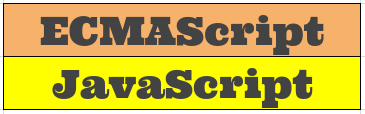

# ECMAScript dan JavaScript

Buku ini ini merupakan buku bebas dengan lisensi
[CC-BY-SA](https://creativecommons.org/licenses/by-sa/4.0/legalcode). Buku ini merupakan buku yang dirancang untuk keperluan memberikan pengetahuan mendasar tentang JavaScript dan ekosistemnya. Pembahasan tentang ECMAScript diperlukan karena JavaScript merupakan implementasi dari spesifikasi ECMAScript dan kedua istilah tersebut sering digunakan secara bergantian. Secara umum, buku ini menggunakan Node.js sebagai platform pengembangan aplikasi JavaScript. Node.js merupakan software di sisi server yang dikembangkan dari _engine_ JavaScript V8 dari Google serta [libuv](https://github.com/joyent/libuv). Versi sebelum 0.9.0 menggunakan _libev_ dari Mark Lechmann.

# Hak Cipta

2017 - Refactory

# Penulis

[Bambang Purnomosidi D. P.](http://bpdp.xyz)
[Twitter](https://twitter.com/bpdp)
[Facebook](https://www.facebook.com/bambangpdp)

