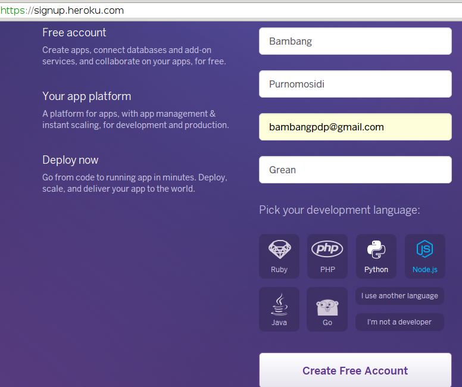
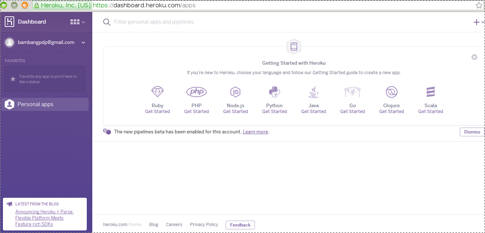
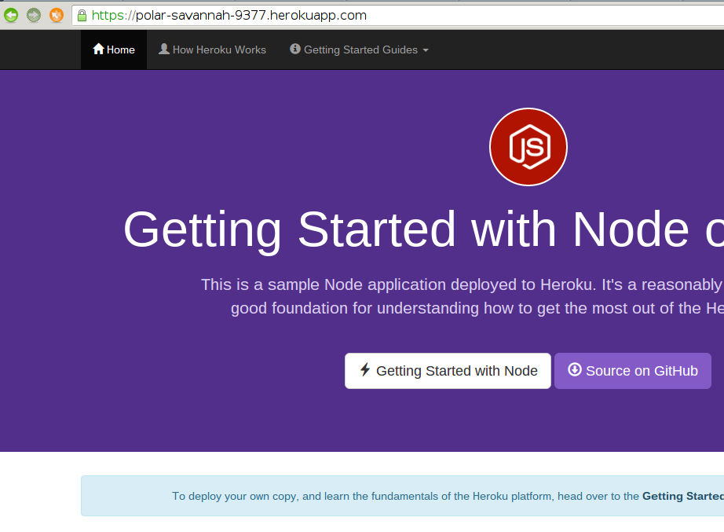

== Pengenalan Cloud Computing dan Infrastruktur Pengembangan Aplikasi Berbasis Node.js

=== Apa itu Cloud Computing?

*Cloud Computing*, atau sering diterjemahkan sebagai *Komputasi
Awan* dalam bahasa Indonesia mempunyai berbagai definisi:

* *Wikipedia*: penggunaan sumber daya komputasi (peranti keras dan
  peranti lunak) yang berfungsi untuk memberikan layanan melalui suatu
  jaringan (pada umumnya Internet).footnote:[http://en.wikipedia.org/wiki/Cloud_computing].
* *NIST (The National Institute of Standards and Technology)*: model
  yang memungkinkan akses jaringan ubiquitous (dari mana saja),
  nyaman, _on-demand_ (saat ada permintaan) ke sekumpulan sumber daya
  komputasi yang dikonfigurasi untuk berbagi (jaringan, server,
  penyimpanan, dan berbagai layanan lain) yang dapat dengan cepat
  ditetapkan dan dirilis dengan usaha yang minimal dari manajemen
  ataupun interaksi dengan penyedia layanan.footnote:[http://csrc.nist.gov/publications/PubsSPs.html#800-145]

[[ccmodel]]
.Model dari Cloud Computing
image::gambar/662px-Cloud_computing.png[Model dari Cloud Computing]

Jika diwujudkan secara visual, Cloud Computing bisa dilihat pada <<ccmodel>>.footnote:[Gambar dibuat oleh Sam Johnston, diambil dari http://en.wikipedia.org/w/index.php?title=File:Cloud_computing.svg&page=1]

=== Karakteristik Cloud Computing

Menurut NIST, ada beberapa karakteristik dari Cloud Computing:

* *On-demand self-service*: layanan bisa diperoleh pada saat diminta, tanpa intervensi atau interaksi manusia di sisi penyedia jasa.
* *Broad network access*: tersedia melalui jaringan dengan berbagai peranti yang umum (komputer, tablet, HP, dan lain-lain)
* *Resource pooling*: sumber daya komputasi dari penyedia jasa terkumpul untuk melayani.
* *Rapid elasticity*: skalabilitas.
* *Measured service*: penggunaan sumber daya bisa diukur, di-monitor, dikendalikan, dan dilaporkan.

Karakteristik lain yang tidak kalah penting adalah _multitenancy_.
_Multitenancy_ merupakan suatu prinsip dalam arsitektur software. Pada
arsitektur tersebut, satu instan dari software berjalan pada server,
melayani banyak organisasi klien. Aplikasi dirancang untuk mempartisi
data dan konfigurasinya secara virtual dan setiap organisasi klien
tersebut bekerja dengan instan aplikasi virtual tersebut.footnote:[http://en.wikipedia.org/wiki/Multitenancy]

=== _Public_ dan _Private Cloud Computing_

Cloud Computing bisa dibangun untuk keperluan pribadi suatu organisasi dan (secara legal) hanya bisa diakses oleh organisasi yang bersangkutan. Tipe tersebut dikenal dengan _Private Cloud Computing_. Sementara itu, jika sumber daya Cloud Computing bisa diakses oleh publik (dengan hak akses yang sesuai), maka model tersebut dikenal sebagai _Public Cloud Computing_. Pembahasan di buku ini adalah pembahasan tentang _Public Cloud Computing_ dan semua referensi tentang Cloud Computing di buku ini akan menunjuk pada _Public Cloud Computing_ kecuali dinyatakan lain.

=== Model Layanan Cloud Computing

Model layanan pada Cloud Computing akan berkembang sesuai kebutuhan konsumen serta inovasi dari berbagai penyedia layanan. Saat ini, pada umumnya, ada tiga model layanan:

* *SaaS* (_Software as a Service_): layanan berupa aplikasi yang ditempatkan pada infrastruktur penyedia layanan, siap digunakan oleh konsumen.
* *PaaS* (_Platform as a Service_): menyediakan layanan ke konsumen berupa platform untuk men-deploy aplikasi.
* *IaaS* (_Infrastructure as a Service_): menyediakan layanan ke konsumen berupa berbagai sumber daya komputasi (pemrosesam, penyimpanan, jaringan, dan sumber daya fundamental lainnya).

Meski sampai saat ini, umumnya terdapat tiga model tersebut, beberapa model kelihatannya sudah mulai muncul, misalnya STaaS (_Storage as a Service_), SECaaS (_Security as a Service_), DaaS (_Data as a Service_), TEaaS (_Test Environment as a Service_), _Desktop Virtualization_, APIaaS (_API as a Service_).

=== Pengembangan Aplikasi di Cloud Computing

Pada umumnya, para pengembang aplikasi di Cloud Computing juga menggunakan pendekatan _Agile Software Development_ yang berbasis pada pengembangan secara iteratif untuk setiap _milestone_ (dalam iterasi analisis-desain-_coding-testing-debugging_) mulai dari _milestone_ paling awal sampai software dirilis. Perbedaan paling mendasar hanyalah pada platform yang digunakan untuk _deployment_, peranti pengembangan yang digunakan, serta utilitas untuk mengelola aplikasi yang di-_deploy_ pada instan di cloud.

Pengembangan aplikasi di Cloud Computing akan melibatkan peranti pengembang yang didukung oleh infrastruktur Cloud. Kita akan memerlukan PaaS untuk keperluan ini. Pada dasarnya pengembangan aplikasi akan meliputi siklus berikut:

* _Coding_
* Test di komputer lokal
* Upload ke server (dalam Cloud Computing, proses ini diistilahkan
  dengan "_push_"
* Edit - push

Jika pengembangan aplikasi dilakukan oleh tim, maka perlu adanya
software untuk _version control_, misalnya
http://www.git-scm.com[Git], http://www.mercurial-scm.org[mercurial], dan lain-lain. Setelah itu, aktivitas yang dilakukan biasanya terpusat pada _push_ (untuk mengupload instan dari aplikasi ke server) dan _pull_ (untuk mengambil instan aplikasi dari server).

=== Node.js dan Cloud Computing

Node.js merupakan salah satu peranti pengembang yang bisa digunakan
untuk membuat aplikasi berbasis Cloud. Node.js dikembangkan dari
_engine_ JavaScript yang dibuat oleh Google untuk browser _Chrome /
Chromium_ (V8) ditambah dengan libUV serta beberapa pustaka internal
lainnya. Dengan menggunakan Node.js, semua pengembangan akan dilakukan
menggunakan JavaScript, baik pada sisi klien maupun server. Node.js
dibuat pertama kali oleh http://twitter.com/ryah[Ryan Dahl]. Saat ini,
Node.js dikembangkan oleh komunitas sebagai software bebas dibawah
_Node.js foundation_ yang merupakan suatu yayasan dibawah _Linux
Foundation_.

=== Membangun SaaS di Heroku

Heroku merupakan perusahaan penyedia PaaS yang didirikan pada tahun
2007. Heroku menyediakan berbagai macam akun. Untuk keperluan buku
      ini, kita akan menggunakan fasilitas gratis dari Heroku. Tujuan
      dari penggunaan Heroku ini adalah untuk memberikan gambaran
      tentang PaaS dan proses pengembangan serta _deployment_ dari
      SaaS yang dibangun.

[NOTE]
====
Pada umumnya, para penyedia PaaS mempunyai _tools_ tersendiri untuk
mengelola aplikasi SaaS bagi para pengembang. Sebagai contoh, jika di
Heroku, kita menggunakan perintah _heroku_ yang ada pada _heroku
toolbelt_, di _Redhat Openshift_ kita menggunakan perintah _rhc_, di
_CloudFoundy_ menggunakan _cf_, dan seterusnya. Sebagai pengembang,
kita harus siap untuk mempelajari cara penggunakan _tools_ tersebut.
====

==== Persiapan

Untuk menggunakan Heroku, kita sudah harus mempunyai akun di Heroku.
Jika belum mempunyai akun di Heroku, kita bisa mendaftar melalui
https://signup.heroku.com/. Berikut ini adalah langkah-langkah
pendaftarannya.

*Mengisi rincian akun*

*Konfirmasi melalui e-mail*

*Mengisi password setelah konfirmasi*

*Proses pendaftaran selesai*

*Masuk ke dashboard*

Setelah proses pendaftaran selesai, pengembang harus menginstall
_Heroku Toolbelt_. Sebelum melakukan instalasi, pastikan _user_ yang
akan melakukan instalasi masuk dalam grup _sudo_ karena perintah
instalasi ini akan melakukan instalasi pada direktori
*/usr/local/heroku*.

*Instalasi Heroku Toolbelt*

Untuk instalasi ini, pengembang bisa mengakses dokumentasi di
https://toolbelt.heroku.com/. Pada dasarnya, beberapa sistem operasi
bisa digunakan, tetapi penulis menggunakan _stand alone_ (Linux non
Ubuntu).

----
$ wget -O- https://toolbelt.heroku.com/install.sh | sh
--2015-10-27 13:20:55--  https://toolbelt.heroku.com/install.sh
Resolving toolbelt.heroku.com (toolbelt.heroku.com)... 54.243.68.124, 54.243.109.73, 23.23.123.117
Connecting to toolbelt.heroku.com (toolbelt.heroku.com)|54.243.68.124|:443... connected.
HTTP request sent, awaiting response... 200 OK
Length: 975 [text/plain]
Saving to: ‘STDOUT’

-                   100%[=====================>]     975  --.-KB/s   in 0s     

2015-10-27 13:21:02 (328 MB/s) - written to stdout [975/975]

This script requires superuser access to install software.
You will be prompted for your password by sudo.
[sudo] password for bpdp: 
Add the Heroku CLI to your PATH using:
$ echo 'PATH="/usr/local/heroku/bin:$PATH"' >> ~/.profile
13:21:19-bpdp@archer:~$
----

Setelah itu, lokasi _bin_ dari _Heroku Toolbelt_ dimasukkan ke PATH
dengan memberi tambahan pada %HOME/.bashrc:

----
export PATH=$PATH:/usr/local/heroku/bin
----

Dengan demikian, setiap kali login, kita bisa menggunakan Heroku
Toolbelt.

==== Login ke Heroku

----
$ heroku login
Enter your Heroku credentials.
Email: bambangpdp@gmail.com
Password (typing will be hidden): 
Logged in as bambangpdp@gmail.com
----

==== Clone Aplikasi Sederhana Node.js

----
$ git clone https://github.com/heroku/node-js-getting-started.git
Cloning into 'node-js-getting-started'...
remote: Counting objects: 439, done.
remote: Total 439 (delta 0), reused 0 (delta 0), pack-reused 439
Receiving objects: 100% (439/439), 223.84 KiB | 76.00 KiB/s, done.
Resolving deltas: 100% (64/64), done.
Checking connectivity... done.
$ cd node-js-getting-started
----

==== _Create_ Aplikasi di Heroku

----
$ heroku create
Creating polar-savannah-9377... done, stack is cedar-14
https://polar-savannah-9377.herokuapp.com/ | https://git.heroku.com/polar-savannah-9377.git
Git remote heroku added
$ 
----

Setelah itu, push aplikasi ke server:

----
$ git push heroku master
Counting objects: 430, done.
Delta compression using up to 8 threads.
Compressing objects: 100% (335/335), done.
Writing objects: 100% (430/430), 221.59 KiB | 0 bytes/s, done.
Total 430 (delta 62), reused 430 (delta 62)
remote: Compressing source files... done.
remote: Building source:
remote: 
remote: -----> Node.js app detected
remote: 
remote: -----> Creating runtime environment
remote:        
remote:        NPM_CONFIG_LOGLEVEL=error
remote:        NPM_CONFIG_PRODUCTION=true
remote:        NODE_ENV=production
remote:        NODE_MODULES_CACHE=true
remote: 
remote: -----> Installing binaries
remote:        engines.node (package.json):  0.12.7
remote:        engines.npm (package.json):   unspecified (use default)
remote:        
remote:        Downloading and installing node 0.12.7...
remote:        Using default npm version: 2.11.3
remote: 
remote: -----> Restoring cache
remote:        Skipping cache restore (new runtime signature)
remote: 
remote: -----> Building dependencies
remote:        Pruning any extraneous modules
remote:        Installing node modules (package.json)
remote:        ejs@2.3.3 node_modules/ejs
remote:        
remote:        express@4.13.3 node_modules/express
remote:        ├── escape-html@1.0.2
remote:        ├── merge-descriptors@1.0.0
remote:        ├── array-flatten@1.1.1
remote:        ├── cookie@0.1.3
remote:        ├── utils-merge@1.0.0
remote:        ├── cookie-signature@1.0.6
remote:        ├── methods@1.1.1
remote:        ├── fresh@0.3.0
remote:        ├── range-parser@1.0.2
remote:        ├── vary@1.0.1
remote:        ├── path-to-regexp@0.1.7
remote:        ├── content-type@1.0.1
remote:        ├── etag@1.7.0
remote:        ├── parseurl@1.3.0
remote:        ├── content-disposition@0.5.0
remote:        ├── serve-static@1.10.0
remote:        ├── depd@1.0.1
remote:        ├── qs@4.0.0
remote:        ├── on-finished@2.3.0 (ee-first@1.1.1)
remote:        ├── finalhandler@0.4.0 (unpipe@1.0.0)
remote:        ├── debug@2.2.0 (ms@0.7.1)
remote:        ├── send@0.13.0 (destroy@1.0.3, statuses@1.2.1, ms@0.7.1, mime@1.3.4, http-errors@1.3.1)
remote:        ├── proxy-addr@1.0.8 (forwarded@0.1.0, ipaddr.js@1.0.1)
remote:        ├── accepts@1.2.13 (negotiator@0.5.3, mime-types@2.1.7)
remote:        └── type-is@1.6.9 (media-typer@0.3.0, mime-types@2.1.7)
remote: 
remote: -----> Caching build
remote:        Clearing previous node cache
remote:        Saving 2 cacheDirectories (default):
remote:        - node_modules
remote:        - bower_components (nothing to cache)
remote: 
remote: -----> Build succeeded!
remote:        ├── ejs@2.3.3
remote:        └── express@4.13.3
remote:        
remote: -----> Discovering process types
remote:        Procfile declares types -> web
remote: 
remote: -----> Compressing... done, 9.9MB
remote: -----> Launching... done, v3
remote:        https://polar-savannah-9377.herokuapp.com/ deployed to Heroku
remote: 
remote: Verifying deploy... done.
To https://git.heroku.com/polar-savannah-9377.git
 * [new branch]      master -> master
----

Setelah itu, aplikasi yang kita _deploy_ harus dijalankan:

----
$ heroku ps:scale web=1
Scaling dynos... done, now running web at 1:Free.
----

Setelah dijalankan, aplikasi bisa kita akses sesuai dengan alamat URL
yang telah diberikan pada saat _deployment_:

