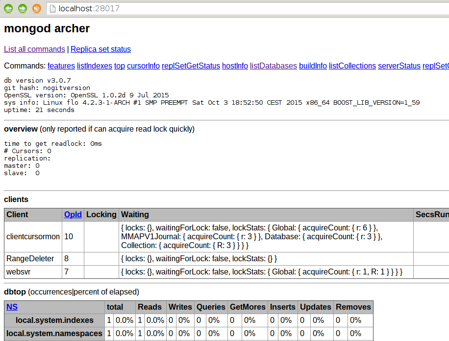

== Mengakses Basis Data NoSQL: mongoDB

=== Apa itu Basis Data NoSQL?

Pada awalnya, istilah NoSQL digunakan oleh Carlo Strozzi untuk
menyebut nama software basis data yang dibuat olehnya. Software basis
data tersebut tidak mengikuti standar SQL, sehingga dia menyebut
software tersebut dengan "NoSQL"
(http://www.strozzi.it/cgi-bin/CSA/tw7/I/en_US/nosql/Home%20Page).
Setelah itu, istilah NoSQL dipopulerkan oleh Eric Evans untuk menyebut
jenis software basis data yang tidak menggunakan standar SQL. Dalam
perkembangan berikutnya, NoSQL ini lebih diarahkan pada "Not Only SQL" dan digunakan untuk kategorisasi basis data _non-relational_ (misalnya  OODBMS, Graph Database, Document-oriented, dan lain-lain). Meski ada
usaha untuk menstandarkan bahasa _query_ untuk NoSQL (UnQL - _Unstructured Query Language_), sampai saat ini usaha tersebut tidak menghasilkan sesuatu hal yang disepakati bersama karena dunia NoSQL memang kompleks sekali. Untuk melihat daftar dari basis data NoSQL, anda bisa melihat ke http://nosql-databases.org.

=== Mengenal mongoDB dan Fitur-fiturnya

mongoDB adalah salah satu software NoSQL yang termasuk dalam kategori _Document Store_ / _Document-Oriented Database_, yaitu data disimpan dalam bentuk dokumen. Suatu dokumen bisa diibaratkan seperti suatu _record_ dalam basis data relasional dan isi dari masing-masing dokumen tersebut bisa berbeda-beda dan ada pula yang sama. Hal ini berbeda dengan basis data relasional yang menetapkan keseragaman kolom serta tipe data dengan data yang NULL jika tidak terdapat data. mongoDB menyimpan data dalam bentuk dokumen dengan menggunakan format JSON.
Berikut adalah fitur dari mongoDB:

* menggunakan format JSON dalam penyimpanan data
* mendukung indeks
* mendukung replikasi
* auto-sharding untuk skalabilitas horizontal
* query yang lengkap
* pembaruan data yang cepat
* mendukung Map/Reduce
* mendukung GridFS

=== Memulai Server

Seperti halnya basis data relasional seperti MySQL, PostgreSQL, dan lain-lain, mongoDB juga memulai dengan menjalankan server yang memungkinkan server tersebut melayani permintaan akses data dokumen melalui klien. Untuk memulai server, siapkan direktori yang akan menjadi tempat menyimpan data (defaultnya adalah /data/db). Jika menginginkan lokasi lain, gunakan argumen _–dbpath_ saat menjalankan server sebagai berikut (buat direktorinya jika belum ada):

----
$ mongod --rest --dbpath ./data
2015-10-27T05:23:37.665+0700 I CONTROL  ** WARNING: --rest is specified without --httpinterface,
2015-10-27T05:23:37.666+0700 I CONTROL  **          enabling http interface
2015-10-27T05:23:37.724+0700 I JOURNAL  [initandlisten] journal dir=./data/journal
2015-10-27T05:23:37.724+0700 I JOURNAL  [initandlisten] recover : no journal files present, no recovery needed
2015-10-27T05:23:45.278+0700 I JOURNAL  [initandlisten] preallocateIsFaster check took 7.553 secs
2015-10-27T05:23:45.410+0700 I JOURNAL  [durability] Durability thread started
2015-10-27T05:23:45.410+0700 I JOURNAL  [journal writer] Journal writer thread started
2015-10-27T05:23:45.465+0700 I CONTROL  [initandlisten] MongoDB starting : pid=9609 port=27017 dbpath=./data 64-bit host=archer
2015-10-27T05:23:45.465+0700 I CONTROL  [initandlisten] 
2015-10-27T05:23:45.465+0700 I CONTROL  [initandlisten] ** WARNING: /sys/kernel/mm/transparent_hugepage/enabled is 'always'.
2015-10-27T05:23:45.465+0700 I CONTROL  [initandlisten] **        We suggest setting it to 'never'
2015-10-27T05:23:45.465+0700 I CONTROL  [initandlisten] 
2015-10-27T05:23:45.465+0700 I CONTROL  [initandlisten] ** WARNING: /sys/kernel/mm/transparent_hugepage/defrag is 'always'.
2015-10-27T05:23:45.465+0700 I CONTROL  [initandlisten] **        We suggest setting it to 'never'
2015-10-27T05:23:45.465+0700 I CONTROL  [initandlisten] 
2015-10-27T05:23:45.465+0700 I CONTROL  [initandlisten] db version v3.0.7
2015-10-27T05:23:45.465+0700 I CONTROL  [initandlisten] git version: nogitversion
2015-10-27T05:23:45.465+0700 I CONTROL  [initandlisten] build info: Linux flo 4.2.3-1-ARCH #1 SMP PREEMPT Sat Oct 3 18:52:50 CEST 2015 x86_64 BOOST_LIB_VERSION=1_59
2015-10-27T05:23:45.466+0700 I CONTROL  [initandlisten] allocator: tcmalloc
2015-10-27T05:23:45.466+0700 I CONTROL  [initandlisten] options: { net: { http: { RESTInterfaceEnabled: true, enabled: true } }, storage: { dbPath: "./data" } }
2015-10-27T05:23:45.467+0700 I NETWORK  [websvr] admin web console waiting for connections on port 28017
2015-10-27T05:23:45.467+0700 I NETWORK  [initandlisten] waiting for connections on port 27017
----

Untuk mengakhiri server, tekan __Ctrl-C__, mongoDB akan mengakhiri server sebagai berikut:

----
^C2015-10-27T05:24:30.593+0700 I CONTROL  [signalProcessingThread] got signal 2 (Interrupt), will terminate after current cmd ends
2015-10-27T05:24:30.593+0700 I CONTROL  [signalProcessingThread] now exiting
2015-10-27T05:24:30.593+0700 I NETWORK  [signalProcessingThread] shutdown: going to close listening sockets...
2015-10-27T05:24:30.593+0700 I NETWORK  [signalProcessingThread] closing listening socket: 5
2015-10-27T05:24:30.593+0700 I NETWORK  [signalProcessingThread] closing listening socket: 6
2015-10-27T05:24:30.593+0700 I NETWORK  [signalProcessingThread] closing listening socket: 7
2015-10-27T05:24:30.593+0700 I NETWORK  [signalProcessingThread] removing socket file: /tmp/mongodb-27017.sock
2015-10-27T05:24:30.593+0700 I NETWORK  [signalProcessingThread] shutdown: going to flush diaglog...
2015-10-27T05:24:30.593+0700 I NETWORK  [signalProcessingThread] shutdown: going to close sockets...
2015-10-27T05:24:30.593+0700 I STORAGE  [signalProcessingThread] shutdown: waiting for fs preallocator...
2015-10-27T05:24:30.593+0700 I STORAGE  [signalProcessingThread] shutdown: final commit...
2015-10-27T05:24:30.593+0700 I JOURNAL  [signalProcessingThread] journalCleanup...
2015-10-27T05:24:30.594+0700 I JOURNAL  [signalProcessingThread] removeJournalFiles
2015-10-27T05:24:30.651+0700 I JOURNAL  [signalProcessingThread] Terminating durability thread ...
2015-10-27T05:24:30.696+0700 I JOURNAL  [journal writer] Journal writer thread stopped
2015-10-27T05:24:30.696+0700 I JOURNAL  [durability] Durability thread stopped
2015-10-27T05:24:30.696+0700 I STORAGE  [signalProcessingThread] shutdown: closing all files...
2015-10-27T05:24:30.697+0700 I STORAGE  [signalProcessingThread] closeAllFiles() finished
2015-10-27T05:24:30.697+0700 I STORAGE  [signalProcessingThread] shutdown: removing fs lock...
2015-10-27T05:24:30.697+0700 I CONTROL  [signalProcessingThread] dbexit:  rc: 0
----

=== Klien dan Shell mongoDB

[[img-mongo-web]]
.Antarmuka web untuk mongoDB

Setelah server hidup, pemrogram bisa menggunakan antarmuka
administrasi web maupun menggunakan shell. _Admin web console_ bisa
diakses menggunakan port 28017 seperti pada gambar <>. Sementara itu, untuk mengakses server menggunakan shell, bisa digunakan perintah _mongo_ sebagai berikut:

----
$ mongo
MongoDB shell version: 3.0.7
connecting to: test
Server has startup warnings: 
2015-10-27T05:30:38.403+0700 I CONTROL  ** WARNING: --rest is specified without --httpinterface,
2015-10-27T05:30:38.403+0700 I CONTROL  **          enabling http interface
2015-10-27T05:30:52.277+0700 I CONTROL  [initandlisten] 
2015-10-27T05:30:52.277+0700 I CONTROL  [initandlisten] ** WARNING: /sys/kernel/mm/transparent_hugepage/enabled is 'always'.
2015-10-27T05:30:52.277+0700 I CONTROL  [initandlisten] **        We suggest setting it to 'never'
2015-10-27T05:30:52.277+0700 I CONTROL  [initandlisten] 
2015-10-27T05:30:52.277+0700 I CONTROL  [initandlisten] ** WARNING: /sys/kernel/mm/transparent_hugepage/defrag is 'always'.
2015-10-27T05:30:52.277+0700 I CONTROL  [initandlisten] **        We suggest setting it to 'never'
2015-10-27T05:30:52.277+0700 I CONTROL  [initandlisten] 
> 
----

[NOTE]
====
Peranti lunak mongoDB yang digunakan pada buku ini tidak dioptimasi
sehingga muncul peringatan-peringatan untuk mengubah setting "always"
menjadi "never". Jika ingin menggunakan untuk level _production_,
disarankan untuk melakukan optimasi setting.
====

=== Documents dan Collections

Konsep dasar yang harus dipahami dalam mongoDB sebagai _document-oriented database_ adalah _documents_ dan _collections_. Sama halnya dengan basis data relasional, mongoDB menyimpan data dalam suatu basis data. Di dalam basis data tersebut terdapat _collections_ yang bisa diibaratkan seperti tabel dalam basis data relasional. _Collections_ digunakan untuk menyimpan dokumen (_documents_). Dalam istilah basis data relasional, _documents_ adalah _records_. Kerjakan latihan berikut untuk memahami pengertian dari _documents_ dan _collections_.

[source, javascript]
----
$ mongo
MongoDB shell version: 3.0.7
connecting to: test
...
... [ jgn pedulikan warning ini ]
...
...
> db
test
> use mydb
switched to db mydb
> show dbs
local	(empty)
> emp1 = { name : "Zaky", address : "Griya Purwa Asri" }
{ "name" : "Zaky", "address" : "Griya Purwa Asri" }
> emp2 = { name : "Ahmad", address : "Purwomartani", email : "zakyahmadaditya@gmail.com" }
{
	"name" : "Ahmad",
	"address" : "Purwomartani",
	"email" : "zakyahmadaditya@gmail.com"
}
> emp3 = { name : "Aditya", address : "Kalasan", phone: "08787878787" }
{ "name" : "Aditya", "address" : "Kalasan", "phone" : "08787878787" }
> db.employees.insert( emp1 )
> db.employees.insert( emp2 )
> db.employees.insert( emp3 )
> show dbs
local	(empty)
mydb	0.0625GB
> db
mydb
> show collections
employees
system.indexes
> db.employees.find()
{ "_id" : ObjectId("50c74b63a7f83cba11e6b21e"), "name" : "Zaky", "address" : 
	"Griya Purwa Asri" }
{ "_id" : ObjectId("50c74b6da7f83cba11e6b21f"), "name" : "Ahmad", "address" : 
	"Purwomartani", "email" : "zakyahmadaditya@gmail.com" }
{ "_id" : ObjectId("50c74b79a7f83cba11e6b220"), "name" : "Aditya", "address" : 
	"Kalasan", "phone" : "08787878787" }
> db.employees.find( {name : "Ahmad"} )
{ "_id" : ObjectId("50c74b6da7f83cba11e6b21f"), "name" : "Ahmad", "address" : 
	"Purwomartani", "email" : "zakyahmadaditya@gmail.com" }
> db.employees.findOne()
{
	"_id" : ObjectId("50c74b63a7f83cba11e6b21e"),
	"name" : "Zaky",
	"address" : "Griya Purwa Asri"
}
> db.employees.find().limit(2)
{ "_id" : ObjectId("50c74b63a7f83cba11e6b21e"), "name" : "Zaky", "address" : 
	"Griya Purwa Asri" }
{ "_id" : ObjectId("50c74b6da7f83cba11e6b21f"), "name" : "Ahmad", "address" : 
	"Purwomartani", "email" : "zakyahmadaditya@gmail.com" }
> 
----

Basis data mongoDB hanya akan dibuat jika sudah dilakukan perintah untuk menyisipkan atau mengisikan data _documents_ ke dalam _collections_ seperti perintah di atas.

=== Node-gyp

Node-gyp merupakan _native add-on build tool_, berfungsi untuk membantu proses kompilasi modul add-on native di Node.js. Node-gyp merupakan software bebas dan bisa diinstall menggunakan npm:

----
$ npm install -g node-gyp
----

Node-gyp ini diinstall pada lokasi global. Pada materi ini, Node-gypa diperlukan untuk membangun _driver_ dari mongoDB sehingga mongoDB bisa diakses oleh Node.js.

==== Driver Node.js untuk mongoDB

Mengakses mongoDB dari Node.js bisa dilakukan dengan menggunakan driver atau berbagai _wrapper_ serta solusi sejenis ORM _Object-Relational Mapping_. Salah satu solusi yang tersedia adalah paket **mongodb**.

* Mongoose (http://mongoosejs.com/)
* Mongojs (https://github.com/gett/mongojs)
* Mongolia (https://github.com/masylum/mongolia)
* Mongoskin (https://github.com/kissjs/node-mongoskin)

=== Mengakses mongoDB dari Node.js

Dengan menggunakan _collections_ dan _documents_ di atas, kita akan mengakses data tersebut menggunakan Node.js. Untuk lebih menyederhanakan, kita akan menggunakan _wrapper_ dari mongoDB native driver, yaitu Mongojs. Install Mongojs lebih dahulu menggunakan npm:

TODO

Setelah itu, buat program sesuai dengan listing program berikut. 

=== Aplikasi Web Menggunakan Node.js dan mongoDB

Contoh aplikasi web berikut hanya digunakan untuk mengambil data dari mongoDB kemudian menampilkannya di web. Data diambil dari basis data mongoDB yang sudah dibuat sebelumnya (mydb). Untuk keperluan ini, kita akan menggunakan framework Express (http://expressjs.com). Install Express di level global dengan __npm install -g express__. Setelah terinstall, buat subdirektori baru (lokasi bebas) yang akan digunakan untuk menyimpan aplikasi web. Setelah itu, masuk ke direktori tersebut kemudian buat kerangka aplikasi di subdirektori tersebut menggunakan
perintah ``express'' (lihat bab 1).

Berikut ini adalah beberapa perubahan yang dilakukan untuk rerangka aplikasi yang dihasilkan dari perintah _express_ tersebut. Selain itu, ada beberapa tambahan file (routes/employee.js dan views/employee.jade), penghapusan file (routes/user.js), dan perubahan yang cukup signifikan pada file __views/index.jade__.

