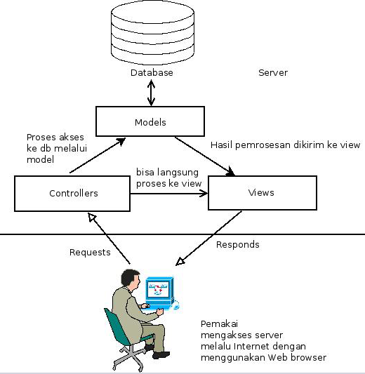

== Pola Arsitektur Aplikasi Web: MVC dan ExpressJS

=== Apa itu Pola Arsitektur?

Pola arsitektur (_architectural pattern_) adalah konsep dan standar arsitektur yang membentuk suatu aplikasi. Pola disini mengacu pada _best practices_ atau praktik-praktik terbaik yang terutama terkait dengan arsitektur dari software aplikasi. Pola arsitektur terdiri atas elemen-elemen software, properti dari elemen-elemen tersebut, serta hubungan antar elemen-elemen tersebut.

=== Pola Arsitektur MVC

MVC (Model-View-Controller) merupakan pola arsitektur aplikasi Web yang memisahkan aplikasi Web menjadi 3 komponen:

* Model: basis data
* View: tampilan antarmuka aplikasi Web, biasanya berisi semacam template dan isi-isi dinamis dari tampilan antarmuka tersebut.
* Controller: menerima _requests_ atau permintaan dari browser kemudian mengarahkan ke _event-handler_ untuk diproses. Proses tersebut bisa saja berupa langsung menghasilkan view (X)HTML atau format lainnya, atau bisa juga diproses terlebih dahulu di model dan kemudian hasilnya akan dikirimkan ke view untuk diisikan ke isi-isi dinamis serta membentuk file (X)HTML untuk ditampilkan di browser (sebenarnya tidak selalu perlu harus (X)HTML).

[[img-mvc]]
.Pola arsitektur MVC

Jika digambarkan dalam suatu diagram, pola arsitektur MVC ditampilkan
pada gambar <>. Pola ini dikenal juga dengan istilah Model 2 dan dipopulerkan oleh JavaEE.

=== Implementasi Pola Arsitektur MVC Menggunakan ExpressJS

Sebenarnya ExpressJS bukan merupakan _framework_ MVC, meskipun
demikian karena framework ini sangat fleksibel, maka pemrogram bisa
mengatur sendiri lokasi dari file / direktori serta berbagai
konfigurasi lainnya. Contoh implementasi disini adalah aplikasi
sederhana untuk menampilkan data yang tersimpan dalam basis data
mongoDB ke dalam format JSON yang bisa diakses dari browser. Contoh
rerangka aplikasi MVC menggunakan Express bisa diperoleh di https://github.com/bpdp/express-mongoose-mvc

=== Pola Arsitektur Aplikasi Web Lain dan Implementasinya

MVC bukan satu-satu pola arsitektur aplikasi Web. Berikut ini adalah beberapa daftar pola arsitektur aplikasi Web serta implementasinya di Node.js dan/atau JavaScript di sisi klien:

- MVP (Model-View-Presenter): Google GWT. MVVM (Model-View-ViewModel): Batman.js (http://batmanjs.org) dan 
Knockout.js (http://knockoutjs.com)
- RVP (Resource-View-Presenter): Flatiron (http://flatironjs.org)
- MVA (Model-View-Adapter).
- Hierarchical MVC
- Presentation-Abstract-Control.
